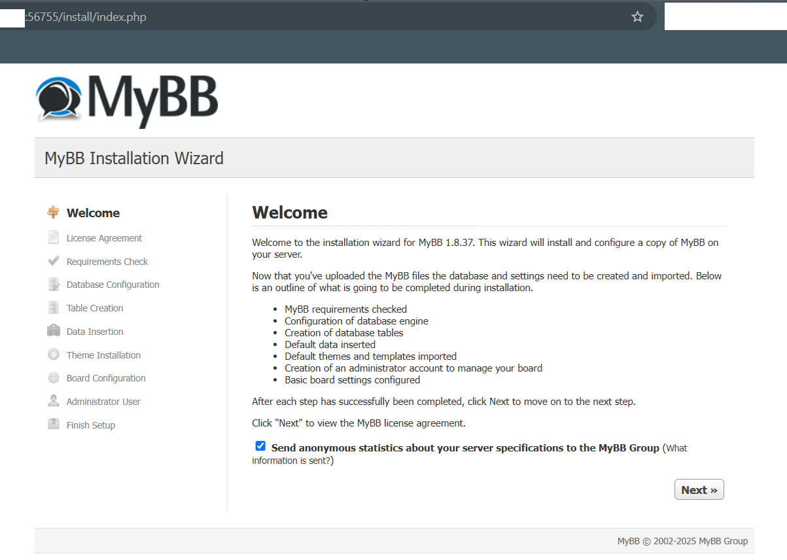

# mybb-docker-auto-installer
MyBB 5 Minute Install. Completely automatic setup for MyBB, faster than ever before. A simple Python script to install all dependencies on Linux, and launch a fresh MyBB install on an available, new port.

Requirements:
- Python (tested with 3.11)
- Network connection
- As-needed permissions on system

```
git clone https://github.com/LNodesL/mybb-docker-auto-installer.git
cd dist
python install.py
```


Complete Usage example:
```
root@server:/path/to/folder/mybbdemo1# python3 install.py
Docker not found locally. Downloading Docker...
  % Total    % Received % Xferd  Average Speed   Time    Time     Time  Current
                                 Dload  Upload   Total   Spent    Left  Speed
100 63.8M  100 63.8M    0     0   213M      0 --:--:-- --:--:-- --:--:--  214M
docker/docker-proxy
docker/containerd-shim-runc-v2
docker/ctr
docker/docker
docker/docker-init
docker/runc
docker/dockerd
docker/containerd
docker/containerd-shim
Docker downloaded and set up locally.
Docker Compose not found locally. Downloading Docker Compose...
  % Total    % Received % Xferd  Average Speed   Time    Time     Time  Current
                                 Dload  Upload   Total   Spent    Left  Speed
  0     0    0     0    0     0      0      0 --:--:-- --:--:-- --:--:--     0
100 57.6M  100 57.6M    0     0   109M      0 --:--:-- --:--:-- --:--:-- 84.2M
Docker Compose downloaded and set up locally.

Docker Version:
Docker version 20.10.24, build 297e128

Docker Compose Version:
Docker Compose version v2.20.2
Starting MyBB setup using Docker Compose...
Trying mirror: mirror.gcr.io
[+] Running 3/3
 ✔ Container mybbdemo1-mybb-1   Started                                                                                                                                                                                                                                                                                                                                                               2.6s 
 ✔ Container mybbdemo1-mysql-1  Started                                                                                                                                                                                                                                                                                                                                                               2.6s 
 ✔ Container mybbdemo1-nginx-1  Started                                                                                                                                                                                                                                                                                                                                                               2.6s 

MyBB is now running!
Access it via:
- http://[ip]:47881/
- http://localhost:47881/


MySQL Database Credentials:
Host: mysql
Database: mybb_db
Username: mybb_user
Password: mybb_password123

Root Password: rootpassword123
```

Proceed with MyBB install via the UI:




## Dev Notes

This is from prototyping / experiments. This is not tested on multiple env types. It was tested on a few recent Ubuntu / LTS. Database credentials and other config settings should be randomized in production. It is advised that you only run the installer once per folder, or to completely delete generated files between uses if you are testing install.py.
